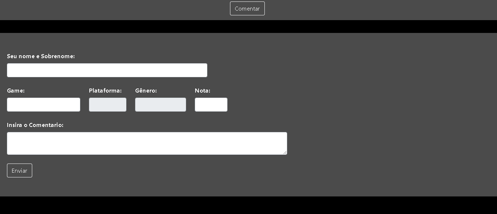
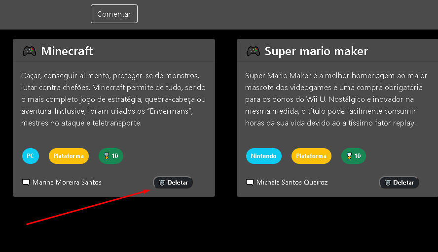

<h1>!games@OP Vue.js</h1>

<h2> Instalação local</h2>

Dentro do diretorio, Deve ser feito a instalação das dependencias com o seguinte comando:

<i>- npm install;</i>

 

<h2>Iniciando servidor</h2>

Após isso, para iniciar, dentro do diretorio raiz, deve ser executado o seguinte comando:

<i>- npm run serve;</i>

<i>- Tambem é necessario executar o aplicativo API_opinião;</i>

<h2> Orientações </h2>

- Por padrão, a aplicação estará configurada para escutar a porta 8080, para altera-la, executar o seguinte comando: 
 

<i>- npm run serve -- --port "PORTA DESEJADA"</i>

- Ao iniciar no navegador com as URL Local: http://localhost:8080/ ou Network: http://192.168.1.6:8080/, será carregado o app no Modelo single page app, onde é possivel vizualizar os comentarios, inserir um novo e deletar; Para inserir um novo comentario, deve ir na opção "comentar", no menu superior:

- Para inserir um novo comentario, deve ser realizado o preenchimento do formulario a seguir:

- Para deletar um comentario, é necessario clicar no icone "Deletar", onde deve ser confirmado o delete por meio de um alerta: 

 

<i> Projeto para demonstar um projeto SPA em constante mudança, avançando para melhoria e implementações de novas funcionalidas;</i>

